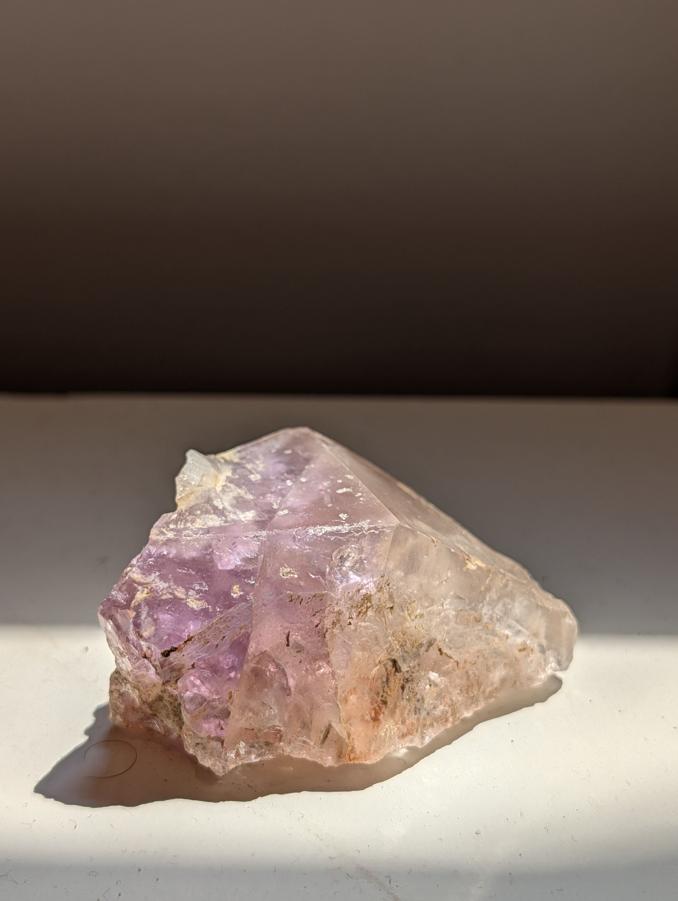
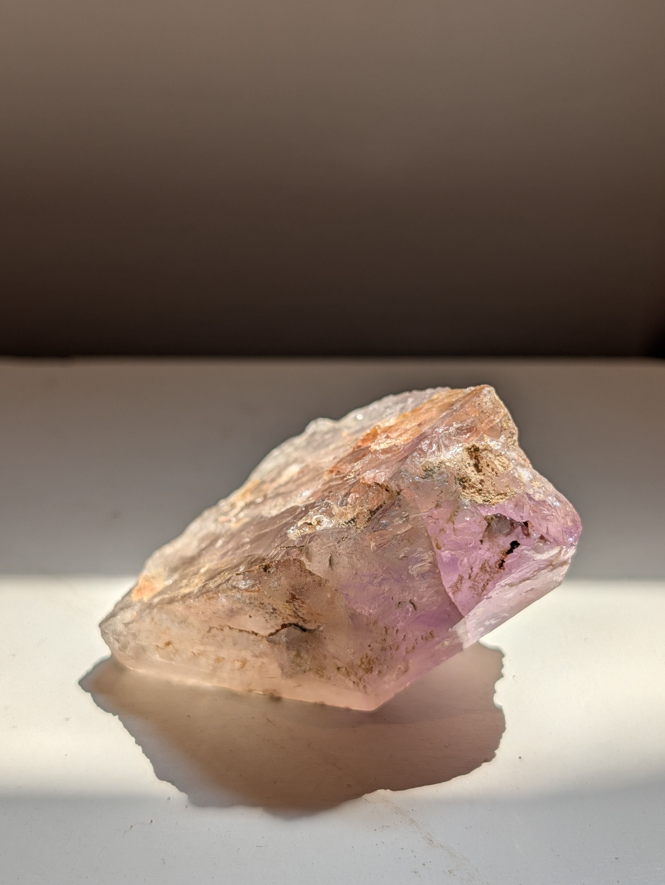
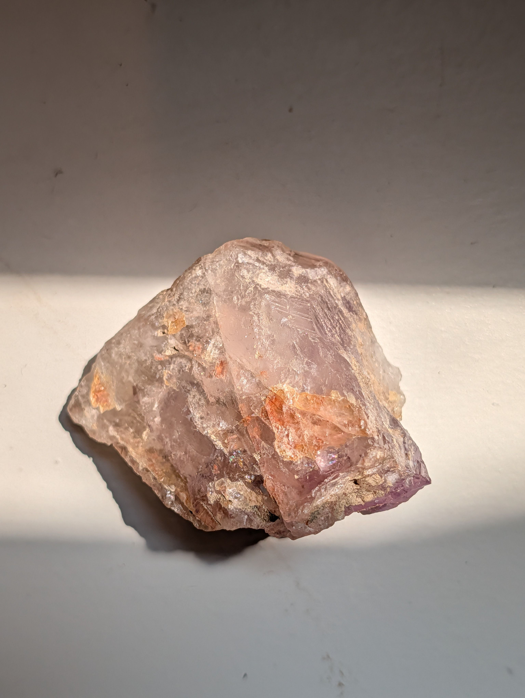

<!-- Generated from the private rock-archive vault by scripts/sync-public.mjs. Do not edit here; edit the vault record and re-sync. -->

# ROCK-0001 — Purple-Zoned Quartz Crystal (Likely Amethyst)

## At a Glance

Picked up in a field near Pamplin City, Virginia, this palm-sized crystal looks so much
like something off a shop shelf that its finder didn't quite believe it had grown that
way on its own. It almost certainly did. Patches of **violet** grade into water-clear and
milky zones, bonded **orange iron staining** runs through the crevices, and thin rainbow
flecks flare along healed internal fractures when the light catches them. The honest
tension in this specimen is the color: the warm pink is real to the eye but strengthens in
sunlight and fades indoors, which is exactly how *lighting* behaves — not proof of a pink
crystal. One five-minute scratch test would settle the last big question.

## Observed Characteristics

Directly visible across the four photographs:

- **Form:** one chunky, wedge-to-blocky crystal, **about 5–6 cm** long (measured), with at
  least one **pyramidal termination**. A natural crystal — not a rounded pebble, and not
  cut or polished.
- **Color and zoning:** strongly **zoned** — pale-to-medium **violet** in patches and
  toward the interior and termination, grading into **near-colorless and milky white**.
  A warm pink-orange cast is present but **light-dependent** (below).
- **Transparency:** transparent to translucent, with cloudier milky domains.
- **Luster:** **vitreous / glassy** on fresh faces; waxy where surfaces are etched.
- **Fracture:** broken areas show **conchoidal-to-irregular fracture**; no flat, stepped
  cleavage planes are visible.
- **Staining:** **bonded orange-brown iron-oxide staining** in the crevices, with a
  whitish crust in places.
- **Internal features:** fine needle-like inclusions and partially healed fractures, plus
  several **spectral "iris" flecks** along internal cracks.

## Collection Context

Found in the field near **Pamplin City, Virginia** on **17 July 2026**, and kept for a
simple reason that turns out to be the most interesting thing about it: it looked
store-bought. The disbelief that a crystal this clean forms in the ground on its own is
worth sitting with, because — if the leading identification holds — that is precisely
what happened, in the quartz-rich bedrock of the Virginia Piedmont. The exact spot is kept
private; the town is as specific as this record gets in public.

## Possible Identification

Photo-based, and the decisive hardness test hasn't been run, so nothing here rises above
**moderate** confidence. The secure part is that this reads as **macrocrystalline quartz** —
a terminated crystal with vitreous luster, transparency, conchoidal fracture, and no
cleavage is a textbook quartz signature ([Common Minerals: Quartz](https://commonminerals.esci.umn.edu/minerals-o-s/quartz)). The open question is what
drives the *colors*.

### Candidate 1: Amethyst (iron-colored purple quartz) — confidence: moderate

- **Supporting visual evidence:** patchy violet zoning strongest toward the interior and
  termination is exactly how amethyst distributes color, which is "typically most intense
  at the crystal terminations" ([Amethyst](https://en.wikipedia.org/wiki/Amethyst)); the quartz form, luster,
  and fracture all fit.
- **Supporting location/geological evidence:** Pamplin City sits in the quartz-rich
  Virginia Piedmont ([The Geology of Virginia — Piedmont](https://geology.blogs.wm.edu/piedmont/)), and amethyst has been reported at the
  county level in and around Appomattox County ([Amethyst / Quartz localities in Appomattox County, Virginia (Vera and vicinity)](https://www.mindat.org/loc-109448.html (Vera, Appomattox County); https://www.mindat.org/min-198.html (Amethyst))) — so
  a field-found amethyst here is geologically plausible and locally precedented. That
  supports *possibility*, not this specific crystal's identity.
- **Evidence that does not fit:** hardness is unconfirmed; whether any purple is natural or
  treated can't be read from a photo (though a field find makes natural color the more
  likely story).
- **What photos cannot determine:** hardness; natural vs treated color; chemistry.
- **Next most useful test:** hardness/scratch — *if it scratches glass and resists a steel
  knife, quartz is confirmed and amethyst holds first place; if the reverse, quartz is
  wrong and this collapses toward fluorite.*

### Candidate 2: Iron-stained, color-zoned quartz — confidence: moderate

*The warm pink/orange is bonded iron staining plus transmitted light, not a separate pink
species.* The color test supports this: the orange-tan **does not wipe off** (so it is
bonded iron oxide), and the pink **strengthens outdoors and dulls indoors** — the behavior
of light passing through a faintly tinted translucent crystal, not of a fixed body color.
This is the most economical explanation of the whole color set. Iron staining is exactly
what's expected on quartz weathered out of Piedmont veins and soil.

### Candidate 3: Euhedral pink quartz (only if the pink is intrinsic) — confidence: low

- **Against:** massive rose quartz "is always anhedral and does not occur as well-formed
  crystals," yet this is a terminated crystal; the rarer euhedral pink quartz does form
  crystals but is pale and **photosensitive — it fades with light**
  ([Rose quartz](https://en.wikipedia.org/wiki/Rose_quartz)). The pink here *brightens* in strong light rather than
  fades, which points away from intrinsic pink quartz and toward a lighting/staining effect.
- **Next most useful test:** photograph in fixed neutral light now and again after weeks of
  normal display — genuine pink quartz would slowly fade.

### Candidate 4: Purple fluorite — confidence: low / speculative (rule-out)

- **Against:** fluorite has perfect octahedral cleavage in four directions producing flat
  stepped surfaces — none is visible; this shows conchoidal fracture and a quartz-style
  termination, and fluorite is much softer (Mohs 4 vs 7) ([Common Minerals: Fluorite](https://commonminerals.esci.umn.edu/minerals-f/fluorite)). Worth
  noting fluorite *does* occur regionally (Amelia County pegmatites,
  [Amelia County — Geology and Mineral Resources](https://energy.virginia.gov/geology/Amelia.shtml)), so it can't be excluded on locality alone — which
  is one more reason the hardness test is the thing to do. Morphology argues strongly
  against it.

## Geological Story

If this is quartz, it crystallized from silica-rich fluids in the bedrock of the **Virginia
Piedmont** — a belt of Proterozoic-to-Paleozoic igneous and metamorphic rock, quartz-rich
throughout, that Pamplin City sits within ([The Geology of Virginia — Piedmont](https://geology.blogs.wm.edu/piedmont/)). The violet of
amethyst comes from trace iron plus natural irradiation forming color centers in the quartz
lattice ([Amethyst](https://en.wikipedia.org/wiki/Amethyst)); the bonded orange-tan is later iron oxide picked up
from weathering, not part of the original crystal. Amethyst is documented at the county
level in this corner of the Piedmont ([Amethyst / Quartz localities in Appomattox County, Virginia (Vera and vicinity)](https://www.mindat.org/loc-109448.html (Vera, Appomattox County); https://www.mindat.org/min-198.html (Amethyst))), and the wider
region is a known mineral province — the famous Amelia County pegmatites, in the same
Piedmont belt some tens of miles off, produced amazonite, beryl, garnet, and more
([Amelia County — Geology and Mineral Resources](https://energy.virginia.gov/geology/Amelia.shtml)). All of that is **regional context, not proof about
this crystal**: there is no documented amethyst locality at Pamplin City specifically, and
this record does not claim one. The rainbow "iris" flecks, for the curious, are thin-film
interference from the healing of internal fractures — a structural optical effect, not a
coating or a treatment.

## Why This Rock Is Interesting

The appeal is the honest uncertainty, and the small shock behind it. A crystal that looks
bought — clean faces, a real point, gem-purple in places — came out of an ordinary Virginia
field, and the person who found it could hardly believe it grew that way. It's also a
compact lesson in how identification actually works: form, luster, and fracture pin down
*quartz* almost at a glance, while *which variety* and *what color* hinge on a physical test
and a provenance that a photograph simply can't carry. The pink is the perfect example — it
looks like a property of the stone until you notice it tracks the sunlight, at which point
the interesting question stops being "what color is it" and becomes "what is light doing
here."

## Human History and Uses

*General to the candidate materials — not claims about this specimen.* Amethyst has been a
valued gemstone for millennia and is the traditional birthstone of February
([Amethyst](https://en.wikipedia.org/wiki/Amethyst)). Quartz more broadly is a workhorse material — glassmaking,
abrasives, foundry sand, and, exploiting its piezoelectricity, the timing crystals in
watches and electronics ([Common Minerals: Quartz](https://commonminerals.esci.umn.edu/minerals-o-s/quartz)).

## Claims Register

| Claim | Scope | Status | Sources |
|---|---|---|---|
| Found in the field near Pamplin City, VA, 2026-07-17; ~5–6 cm | this specimen | user-confirmed | |
| Orange-tan staining is bonded (does not wipe off); pink is light-dependent | this specimen | user-confirmed | |
| Terminated crystal, vitreous luster, conchoidal fracture, no cleavage indicates quartz | this specimen | hypothesis | [Common Minerals: Quartz](https://commonminerals.esci.umn.edu/minerals-o-s/quartz) |
| Amethyst is purple quartz colored by iron + irradiation, most intense at terminations | general type | sourced | [Amethyst](https://en.wikipedia.org/wiki/Amethyst) |
| Pamplin City lies in the quartz-rich Virginia Piedmont | general type | sourced | [The Geology of Virginia — Piedmont](https://geology.blogs.wm.edu/piedmont/) |
| Amethyst is reported at the county level in/around Appomattox County | general type | sourced | [Amethyst / Quartz localities in Appomattox County, Virginia (Vera and vicinity)](https://www.mindat.org/loc-109448.html (Vera, Appomattox County); https://www.mindat.org/min-198.html (Amethyst)) |
| Fluorite occurs regionally (Amelia pegmatites) but has cleavage/hardness unlike quartz | general type | sourced | [Amelia County — Geology and Mineral Resources](https://energy.virginia.gov/geology/Amelia.shtml), [Common Minerals: Fluorite](https://commonminerals.esci.umn.edu/minerals-f/fluorite) |
| Euhedral pink quartz is rare and photosensitive; massive rose quartz is anhedral | general type | sourced | [Rose quartz](https://en.wikipedia.org/wiki/Rose_quartz) |
| Warm pink is more likely lighting + iron staining than intrinsic body color | this specimen | inferred | |

## Questions Still Open

- **Is it quartz?** Very likely, but unconfirmed — the glass-scratch/hardness test would
  settle quartz vs fluorite decisively and is the single most valuable next step.
- **Is the pink real?** The evidence leans toward lighting + iron staining; a loupe check of
  whether residual indoor pink tracks the stained zones would finish the question.
- **Which exact setting did it weather out of?** Unknown — there is no Pamplin-specific
  documented locality, only county-level and regional context.

## Related Records

- **Location:** Pamplin City, Virginia (Virginia Piedmont) — *a location page will follow as
  more specimens share it.*
- **Material:** quartz / amethyst — *concept pages will follow as the collection grows.*
- Full identification reasoning is kept in the private working notes.

## Images

## Sources

- **Common Minerals: Quartz**. University of Minnesota, Department of Earth & Environmental Sciences. *Common Minerals (esci.umn.edu)*. [link](https://commonminerals.esci.umn.edu/minerals-o-s/quartz). accessed 2026-07-17
- **Amethyst**. Wikipedia contributors. *Wikipedia, the free encyclopedia*. [link](https://en.wikipedia.org/wiki/Amethyst). accessed 2026-07-17
- **The Geology of Virginia — Piedmont**. The College of William & Mary, Department of Geology. *The Geology of Virginia (geology.blogs.wm.edu)*. [link](https://geology.blogs.wm.edu/piedmont/). accessed 2026-07-17
- **Amethyst / Quartz localities in Appomattox County, Virginia (Vera and vicinity)**. Mindat.org (Hudson Institute of Mineralogy). *Mindat.org mineral & locality database*. [link](https://www.mindat.org/loc-109448.html (Vera, Appomattox County); https://www.mindat.org/min-198.html (Amethyst)). accessed 2026-07-17
- **Rose quartz**. Wikipedia contributors. *Wikipedia, the free encyclopedia*. [link](https://en.wikipedia.org/wiki/Rose_quartz). accessed 2026-07-17
- **Common Minerals: Fluorite**. University of Minnesota, Department of Earth & Environmental Sciences. *Common Minerals (esci.umn.edu)*. [link](https://commonminerals.esci.umn.edu/minerals-f/fluorite). accessed 2026-07-17
- **Amelia County — Geology and Mineral Resources**. Virginia Energy, Division of Geology and Mineral Resources. *energy.virginia.gov*. [link](https://energy.virginia.gov/geology/Amelia.shtml). accessed 2026-07-17

---

*Available*
