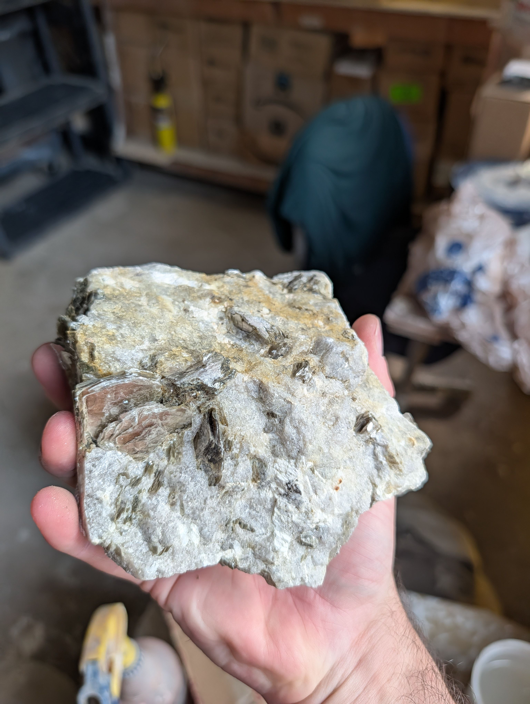
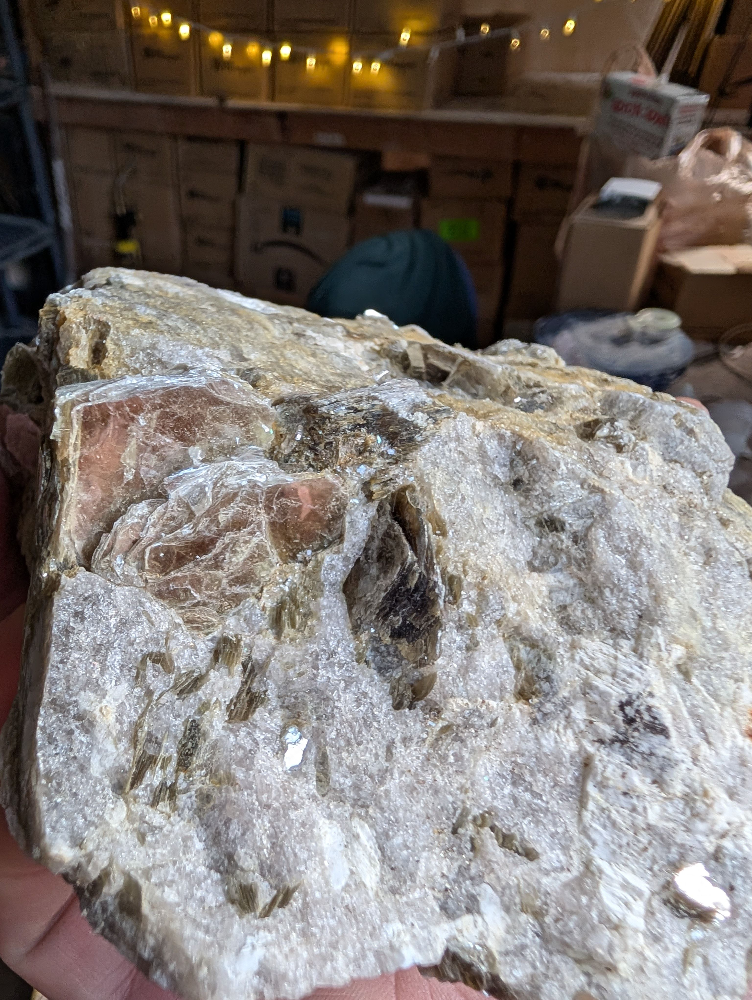
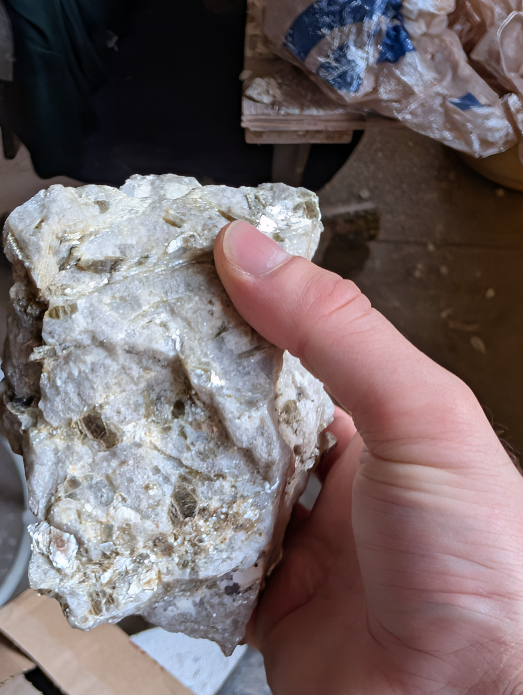
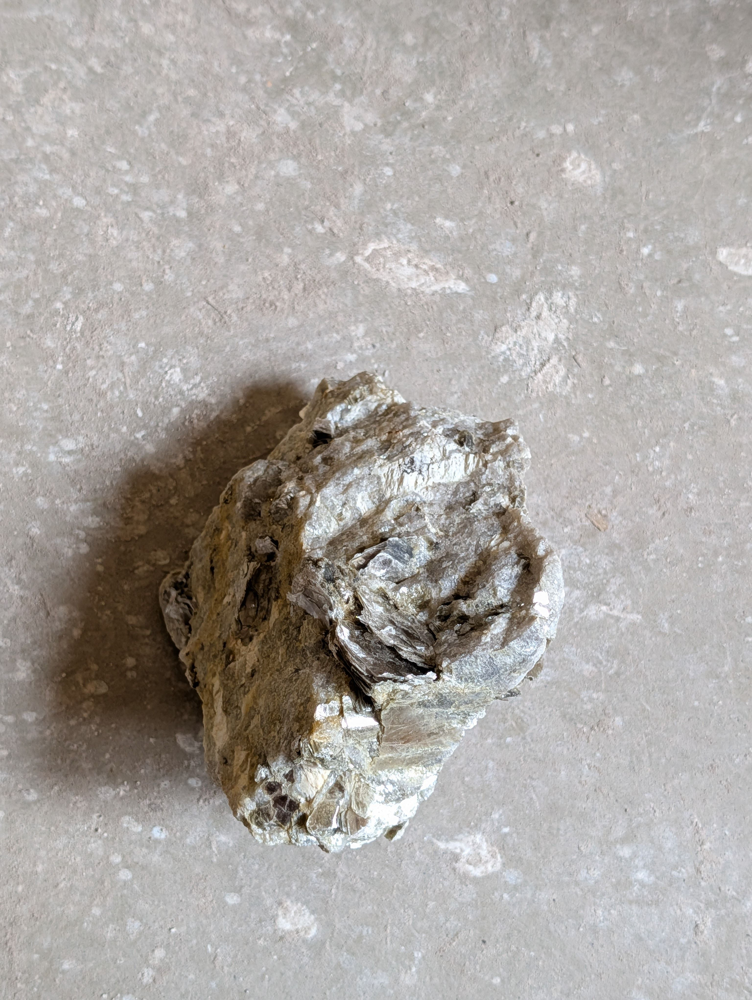

<!-- Generated from the private rock-archive vault by scripts/sync-public.mjs. Do not edit here; edit the vault record and re-sync. -->

# ROCK-0002 — Muscovite–Microcline Pegmatite with Garnet

## At a Glance

A hand-sized slab of coarse crystals that Warren wasn't even looking for. He was out collecting
**feldspar for ceramics** near **Burnsville**, in the Blue Ridge pegmatite country of western North
Carolina, when this and its weathered companion [[ROCK-0003]] turned up — much larger than what he
was after. And it's a beauty of a teaching rock: the **mirror-flashing books** are muscovite mica,
the blocky **salmon-pink crystal** is microcline (a potassium feldspar — the very material he was
hunting), and the little **red-brown grains** are almandine garnet. All three are exactly what the
region's granitic pegmatites are made of ([Spruce Pine Mining District](https://en.wikipedia.org/wiki/Spruce_Pine_Mining_District)). Photo-only,
so a couple of five-minute tests would move it from "well-supported" to "confirmed" — but with a
locality this well matched, the case is strong.

## Observed Characteristics

Directly visible across the seven photographs (no ruler in frame — size judged against the hand):

- **Form and size:** a broken, blocky specimen, roughly **12–15 cm across**, coarsely
  crystalline throughout — no rounding, no polish.
- **Matrix:** dominant **gray-white**, granular-to-glassy and translucent in spots — intergrown
  **quartz and feldspar**.
- **Mica:** abundant **platy "books"** and radiating clusters, **silvery to pale-olive to
  bronze**, throwing strong **pearly-to-glassy flashes** off flat cleavage faces.
- **Pink crystal:** at least one **salmon-pink, blocky** crystal with flat faces — a stubby
  habit unlike the flaky mica.
- **Accessory grains:** scattered small **reddish-brown** equant grains.
- **Condition:** mostly fresh and bright, with a **brown weathered rind** on one edge and a
  faint yellow iron tint locally.

## Collection Context

**Found by Warren on 2 May 2026 near Burnsville, Yancey County, in western North Carolina** —
collected **together with [[ROCK-0003]]** (user-confirmed). He was there **looking for feldspar to
use in ceramics**, not for display specimens, and these two large pieces were a happy surprise. As
he put it, the best finds are often the ones you stumble on when you're focused hard on something
else. Public wording is kept to the **general Burnsville area** at Warren's request; the precise
collecting site is held in the private fields only.

## Possible Identification

Still photo-only, so confidence caps at **moderate** — but the locality supplies strong supporting
evidence, and every candidate below is a documented mineral or rock type of the area's pegmatites.
Full reasoning (with the precise-locality analysis) is kept in the private working notes:
[[ROCK-0002-identification-rev2]] (rev 1 superseded).

### Candidate 1: Granitic pegmatite (muscovite–microcline–plagioclase–quartz) — confidence: moderate, strongly locality-supported

- **Supporting visual evidence:** the coarse quartz + feldspar + mica assemblage with
  centimetre-scale crystals is the pegmatite signature ([Pegmatite](https://en.wikipedia.org/wiki/Pegmatite)); pink
  K-feldspar → microcline ([Microcline](https://en.wikipedia.org/wiki/Microcline)); pale flashing books → muscovite
  ([Muscovite](https://en.wikipedia.org/wiki/Muscovite)).
- **Supporting location/geological evidence:** the Burnsville area lies in the Blue Ridge pegmatite
  belt, whose granitic pegmatites carry exactly "plagioclase, microcline, quartz, and muscovite"
  with accessory "biotite and garnet" ([Spruce Pine Mining District](https://en.wikipedia.org/wiki/Spruce_Pine_Mining_District)). A rock of these
  minerals collected there is very likely a piece of that pegmatite — strong supporting context,
  not absolute proof.
- **Evidence that does not fit:** the district's country rock is mica gneiss/schist, so a coarse
  metamorphic fragment can't be excluded on locality alone.
- **What photographs cannot determine:** random-vs-foliated fabric; microcline vs orthoclase;
  hardness.
- **Next most useful test:** the fabric look (random interlocking → pegmatite), plus the mica peel
  and feldspar cleavage/hardness checks — these would confirm the reading.

### Candidate 2: Coarse mica gneiss / schist (the district's country rock) — confidence: low

Possible because the region's host rock is mica schist/gneiss
([Spruce Pine Mining District](https://en.wikipedia.org/wiki/Spruce_Pine_Mining_District)), but the blocky microcline and random coarse fabric
favour the pegmatite. Settled by the fabric test.

### What the distinctive pieces most likely are

- **Flashing pale mica → muscovite** (peel test confirms) ([Muscovite](https://en.wikipedia.org/wiki/Muscovite)).
- **Pink blocky crystal → microcline** K-feldspar ([Microcline](https://en.wikipedia.org/wiki/Microcline)).
- **Red-brown grains → almandine garnet** — "biotite and garnet" are documented accessories of the
  district's pegmatites ([Spruce Pine Mining District](https://en.wikipedia.org/wiki/Spruce_Pine_Mining_District)); confirm with a
  hardness/no-cleavage check.

## Geological Story

The Burnsville area sits in a Blue Ridge **pegmatite district** — the North Toe River belt of
western North Carolina, one of the classic Appalachian sources of sheet mica, feldspar, kaolin,
and, famously, **ultra-high-purity quartz** (the district supplies "approximately 70–90% of the
world's high-purity quartz" for semiconductor silicon) ([Spruce Pine Mining District](https://en.wikipedia.org/wiki/Spruce_Pine_Mining_District)).
Its pegmatites formed when **granitic magma intruded older Blue Ridge metamorphic rock** and its
last, water-rich melt fraction crystallized slowly enough to grow the outsized muscovite, feldspar,
and quartz crystals that make this rock look the way it does ([Pegmatite](https://en.wikipedia.org/wiki/Pegmatite)); the
small garnets are a normal accessory. **Age is genuinely disputed** across sources — mica dating
gives ~336 Ma (Mississippian), other work ~380 Ma (Devonian), with older host rocks — so the record
hedges it as "Paleozoic" rather than choosing a figure ([Spruce Pine Mining District](https://en.wikipedia.org/wiki/Spruce_Pine_Mining_District)).

## Why This Rock Is Interesting

Two things. First, the **serendipity**: Warren went out for humble feldspar to put into pottery and
came back with a fistful of textbook pegmatite — mica you can watch cleave, feldspar in a clean
pink crystal, garnet in little red beads. The best specimens really do tend to arrive when you're
concentrating on something else. Second, it's a clean teaching pair with its companion
[[ROCK-0003]]: this is the **fresh** face of the region's pegmatite, that one the **weathered**
face. And it's a small lesson in how locality tightens an identification — the same rock with
"origin unknown" was a coin-flip between pegmatite and schist; knowing it came from Blue Ridge
pegmatite country makes it almost certainly the pegmatite.

## Human History and Uses

*General to the materials — but with a direct personal connection here.* **Feldspar** is a core
raw material for **ceramics and glass** ([Microcline](https://en.wikipedia.org/wiki/Microcline)) — which is exactly why
Warren was collecting it; the pink microcline in this rock is the potter's mineral. **Muscovite**
serves as sheet and ground mica (insulators, fillers) ([Muscovite](https://en.wikipedia.org/wiki/Muscovite)); **quartz**
in glass, abrasives, and high-purity silicon ([Common Minerals: Quartz](https://commonminerals.esci.umn.edu/minerals-o-s/quartz)). "Mica, kaolin, quartz and
feldspar" are, in fact, precisely what this region is mined for
([Spruce Pine Mining District](https://en.wikipedia.org/wiki/Spruce_Pine_Mining_District)) — so this hand sample is, in miniature, the raw
material of a working economic pegmatite (context, not a claim that this piece is ore).

## Claims Register

| Claim | Scope | Status | Sources |
|---|---|---|---|
| Found by Warren near Burnsville, Yancey Co., NC on 2 May 2026, together with ROCK-0003, while collecting feldspar for ceramics | this specimen | user-confirmed | |
| Coarse rock of quartz + feldspar + mica with a salmon-pink blocky crystal, pale mica books, and small red-brown grains | this specimen | inferred (visual) | |
| The Burnsville-area (Spruce Pine district) pegmatites carry microcline/plagioclase/quartz/muscovite + accessory biotite & garnet, in Blue Ridge country rock | general type | sourced | [Spruce Pine Mining District](https://en.wikipedia.org/wiki/Spruce_Pine_Mining_District) |
| The district supplies ~70–90% of the world's high-purity quartz | general type | sourced | [Spruce Pine Mining District](https://en.wikipedia.org/wiki/Spruce_Pine_Mining_District) |
| Pegmatite age ~336 Ma vs ~380 Ma | general type | disputed | [Spruce Pine Mining District](https://en.wikipedia.org/wiki/Spruce_Pine_Mining_District) |
| This specimen is a granitic pegmatite (leading), the pink crystal microcline, the red-brown grains almandine garnet | this specimen | hypothesis / inferred | [Pegmatite](https://en.wikipedia.org/wiki/Pegmatite), [Microcline](https://en.wikipedia.org/wiki/Microcline) |
| Muscovite = pale elastic-cleaving mica; microcline = pink K-feldspar, H 6–6.5, ~90° cleavage; feldspar is a ceramic raw material | general type | sourced | [Muscovite](https://en.wikipedia.org/wiki/Muscovite), [Microcline](https://en.wikipedia.org/wiki/Microcline) |

## Questions Still Open

- **Pegmatite vs. country-rock gneiss/schist?** Decided by the fabric test (random vs. foliated).
- **Confirm the pieces:** mica peel (→ muscovite), pink-crystal cleavage/hardness (→ microcline),
  red-brown grains hardness/no-cleavage (→ almandine garnet).
- **Keep or sell?** The ceramics-hunt story suggests a possible keeper; availability is Warren's
  call at review (default: not for sale).
- **Any aquamarine (beryl)?** Worth scanning, given the region.

## Related Records

- **Location:** [[Burnsville, North Carolina]] (general area; precise site kept private)
- **Materials:** [[Muscovite]] · [[Quartz]] · [[Granitic Pegmatite]]
- **Theme:** [[Unresolved Identifications]] — supported but awaiting a confirming test.
- **Companion specimen:** [[ROCK-0003]] — found with this one; the weathered face of the same
  material.

## Images

*Draft — no export selection approved yet (Warren chooses at publication review). Embedded here
for review in the vault.*

## Sources

- **Spruce Pine Mining District**. Wikipedia contributors (drawing on USGS Bulletin 1122-A and district studies). *Wikipedia, The Free Encyclopedia*. [link](https://en.wikipedia.org/wiki/Spruce_Pine_Mining_District). accessed 2026-07-18
- **Pegmatite**. Wikipedia contributors. *Wikipedia, The Free Encyclopedia*. [link](https://en.wikipedia.org/wiki/Pegmatite). accessed 2026-07-18
- **Microcline**. Wikipedia contributors. *Wikipedia, The Free Encyclopedia*. [link](https://en.wikipedia.org/wiki/Microcline). accessed 2026-07-18
- **Muscovite**. Wikipedia contributors. *Wikipedia, The Free Encyclopedia*. [link](https://en.wikipedia.org/wiki/Muscovite). accessed 2026-07-18
- **Common Minerals: Quartz**. University of Minnesota, Department of Earth & Environmental Sciences. *Common Minerals (esci.umn.edu)*. [link](https://commonminerals.esci.umn.edu/minerals-o-s/quartz). accessed 2026-07-17
