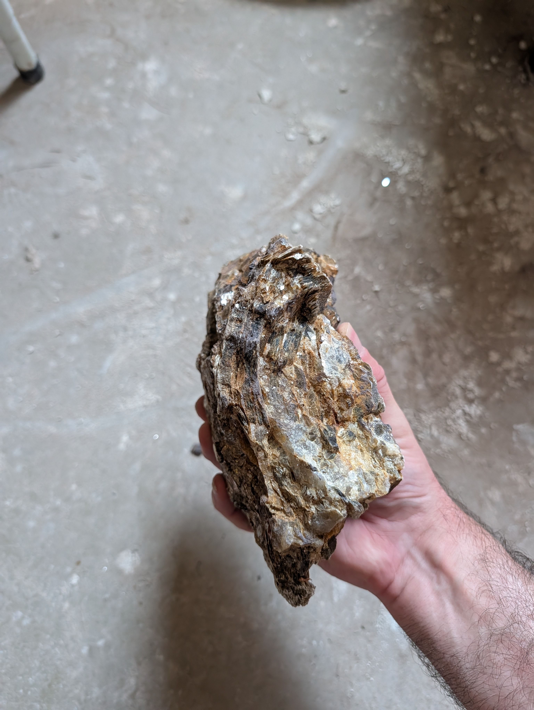
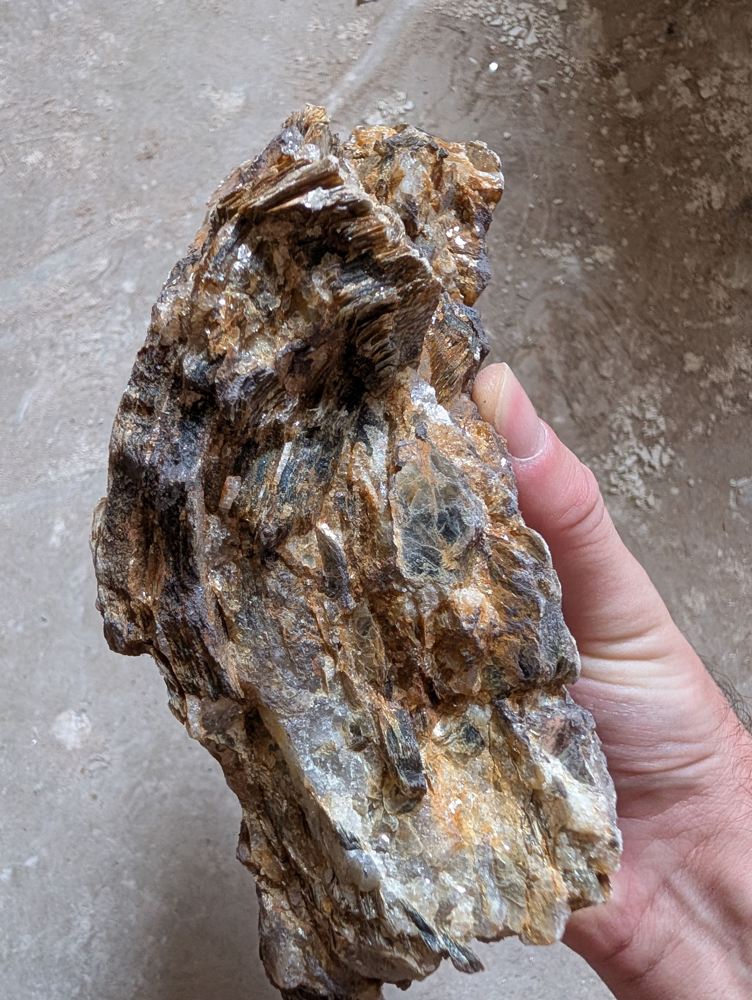
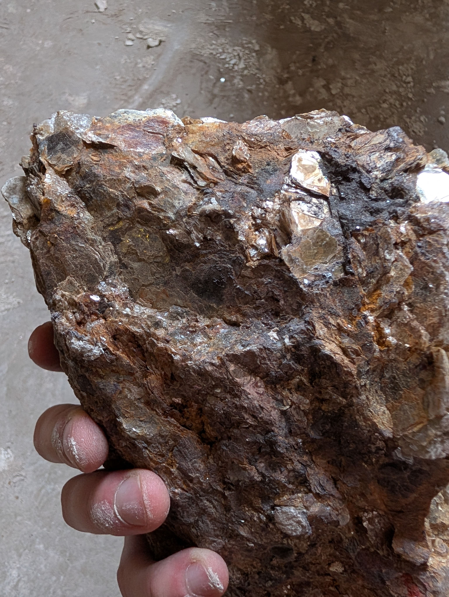
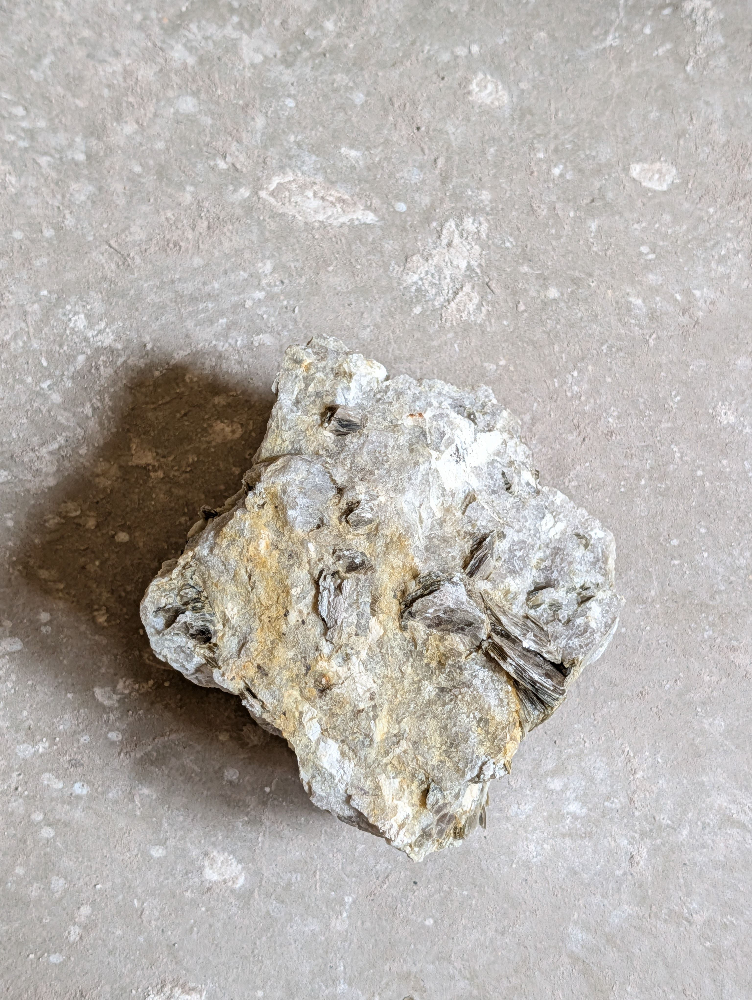

<!-- Generated from the private rock-archive vault by scripts/sync-public.mjs. Do not edit here; edit the vault record and re-sync. -->

# ROCK-0003 — Iron-Stained Weathered Mica–Quartz Rock

## At a Glance

Found the same day as its fresh companion [[ROCK-0002]] — while Warren was near **Burnsville**
collecting feldspar for ceramics — this hand-sized rock is the same family of minerals (**mica and
quartz**) but **rusted through by weathering** into a warm yellow-to-reddish-brown. The interesting
question isn't "what colour is it" but "**what was it before it weathered?**" — a piece of the
region's coarse pegmatite, or of the mica-schist country rock it intruded. The pervasive rust is
just iron oxide (limonite/goethite), the ordinary product of iron-bearing minerals breaking down
near the surface ([Limonite](https://en.wikipedia.org/wiki/Limonite)). Knowing the general locality settles the
*family*; one streak test and one split would settle the rest.

## Observed Characteristics

Across the seven photographs (size judged against the hand; no ruler):

- **Colour:** pervasively **rusty yellow-brown to reddish-brown** — an iron-oxide–stained,
  weathered surface rather than a fresh one.
- **Mica:** abundant **reflective cleavage faces**, silvery to **bronze/golden**, flashing across
  most surfaces.
- **Quartz:** **translucent gray-to-honey** glassy zones and lenses throughout.
- **Fabric:** locally **bladed / roughly layered**, elsewhere massive; a granular oxidized
  **rind** on the face it rested on.
- **Size:** **hand-sized**, comparable to ROCK-0002.

## Collection Context

**Found by Warren on 2 May 2026 near Burnsville, Yancey County, NC — together with [[ROCK-0002]]**
(user-confirmed), while he was out collecting **feldspar for ceramics**. Same locality, same find;
this is the weathered member of the pair. Public wording is kept to the **general Burnsville area**
at Warren's request; the precise collecting site is held in the private fields only.

## Possible Identification

Photo-only and heavily weathered, so confidence on the **protolith stays low** — but the locality
explains the rock's dominant feature (the rust) as ordinary near-surface weathering. Full reasoning
(with the precise-locality analysis) is kept in the private working notes:
[[ROCK-0003-identification-rev2]] (rev 1 superseded).

The secure read is compositional: a **mica + quartz rock from the Burnsville-area pegmatite belt,
overprinted by iron-oxide (goethite/limonite) weathering** — limonite being "a field term for a
mixture of … hydrated iron oxide minerals, among them goethite," a "yellowish brown" secondary
weathering product ([Limonite](https://en.wikipedia.org/wiki/Limonite)). What's open is the fresh rock beneath.

### Candidate 1: Weathered granitic pegmatite (Spruce Pine district type) — confidence: low–moderate

- **Supporting evidence:** found with, and a weathered look-alike of, the pegmatitic ROCK-0002;
  coarse mica + quartz matches the region's pegmatites ([Spruce Pine Mining District](https://en.wikipedia.org/wiki/Spruce_Pine_Mining_District));
  the stain is ordinary iron-oxide weathering ([Limonite](https://en.wikipedia.org/wiki/Limonite)).
- **Against:** fresh feldspar isn't clearly visible (it may have weathered toward clay/kaolin — the
  district is mined for kaolin, a feldspar-weathering product); staining may hide a fabric.
- **Next test:** streak the rust (yellow-brown → iron oxide); glass-scratch a clear zone (→ quartz).

### Candidate 2: Weathered mica gneiss / schist (the region's country rock) — confidence: low–moderate

- **Supporting evidence:** the Spruce Pine host rock is "mica gneiss and schist"
  ([Spruce Pine Mining District](https://en.wikipedia.org/wiki/Spruce_Pine_Mining_District)); the bladed/layered look could be a relict foliation.
- **Against:** no clean through-going schistose split is obvious.
- **Next test:** try to split it along a planar mica-rich grain (→ schist) vs. irregular break
  (→ pegmatite/vein).

### A weathering mechanism

The **bronze/golden** micas may be partly **weathered biotite** — darker than muscovite, and a
ready source of iron as it breaks down ([Muscovite](https://en.wikipedia.org/wiki/Muscovite), [Limonite](https://en.wikipedia.org/wiki/Limonite));
the silvery flakes are more likely the resistant muscovite. *(Inference.)*

## Geological Story

Two chapters. **Origin:** the same Blue Ridge pegmatite setting as [[ROCK-0002]] — Paleozoic
granitic pegmatites (age disputed, ~336–380 Ma) intruded into older mica gneiss/schist in the North
Toe River belt of western NC ([Spruce Pine Mining District](https://en.wikipedia.org/wiki/Spruce_Pine_Mining_District)); this rock is either a
weathered piece of that pegmatite or of its country rock. **Weathering:** the chapter written all
over the surface — near the ground, iron-bearing minerals (biotite, and/or trace iron oxide)
oxidized and hydrated, spreading yellow-brown iron oxide through the rock
([Limonite](https://en.wikipedia.org/wiki/Limonite)). That overprint is the specimen's most legible feature and the
easiest to confirm.

## Why This Rock Is Interesting

It's a **weathering specimen** with a real backstory, and it's better as half of a pair than alone.
Set beside the fresh [[ROCK-0002]] — both scooped up on the same feldspar-hunting trip near
Burnsville — it's a same-locality **before-and-after**: what the region's mica-and-quartz rock looks
like fresh, and what time, water, and air make of it. It's also an honest little puzzle the record
deliberately leaves open: knowing the general locality fixes the *family*, but not whether the fresh
rock was the pegmatite or the schist it intruded — that still needs a hand test, and the record says
so rather than guessing.

## Human History and Uses

*General type only.* Mica and quartz as for [[ROCK-0002]] (the region's economic products, and the
feldspar Warren was after for ceramics); the iron-oxide staining material (limonite/goethite) has
historically been used as **ochre pigment** ([Limonite](https://en.wikipedia.org/wiki/Limonite)) — a note about the
stain, not a claim that this rock is an ore.

## Claims Register

| Claim | Scope | Status | Sources |
|---|---|---|---|
| Found by Warren near Burnsville, Yancey Co., NC on 2 May 2026, together with ROCK-0002, while collecting feldspar for ceramics | this specimen | user-confirmed | |
| Hand-sized mica + quartz rock, pervasively iron-stained yellow-brown, locally bladed | this specimen | inferred (visual) | |
| Limonite/goethite is a yellow-brown iron-oxide weathering product that stains rocks | general type | sourced | [Limonite](https://en.wikipedia.org/wiki/Limonite) |
| The Burnsville-area (Spruce Pine district) pegmatites and their mica gneiss/schist country rock carry mica + quartz + feldspar | general type | sourced | [Spruce Pine Mining District](https://en.wikipedia.org/wiki/Spruce_Pine_Mining_District) |
| Fresh protolith was a coarse mica–quartz rock (weathered pegmatite or country-rock schist) | this specimen | hypothesis | [Pegmatite](https://en.wikipedia.org/wiki/Pegmatite), [Schist](https://en.wikipedia.org/wiki/Schist) |
| Pervasive rust is near-surface iron-oxide weathering, likely from biotite | this specimen | inferred | [Limonite](https://en.wikipedia.org/wiki/Limonite) |

## Questions Still Open

- **Weathered pegmatite or country-rock schist?** Decided by the split/fabric test.
- **Confirm the rust and quartz:** streak (→ iron oxide) and glass-scratch (→ quartz).
- **Keep or sell?** Availability is Warren's call at review; strongest offered as a fresh/weathered
  pair with ROCK-0002 (default: not for sale).

## Related Records

- **Location:** [[Burnsville, North Carolina]] (general area; precise site kept private)
- **Materials:** [[Muscovite]] · [[Quartz]] · [[Granitic Pegmatite]] (as a *possible* fresh protolith)
- **Theme:** [[Unresolved Identifications]] — a physical test would sharpen it.
- **Companion specimen:** [[ROCK-0002]] — found with this one; the fresh face of the same material.

## Images

*Draft — no export selection approved yet. Embedded here for review in the vault.*

## Sources

- **Limonite**. Wikipedia contributors. *Wikipedia, The Free Encyclopedia*. [link](https://en.wikipedia.org/wiki/Limonite). accessed 2026-07-18
- **Spruce Pine Mining District**. Wikipedia contributors (drawing on USGS Bulletin 1122-A and district studies). *Wikipedia, The Free Encyclopedia*. [link](https://en.wikipedia.org/wiki/Spruce_Pine_Mining_District). accessed 2026-07-18
- **Muscovite**. Wikipedia contributors. *Wikipedia, The Free Encyclopedia*. [link](https://en.wikipedia.org/wiki/Muscovite). accessed 2026-07-18
- **Pegmatite**. Wikipedia contributors. *Wikipedia, The Free Encyclopedia*. [link](https://en.wikipedia.org/wiki/Pegmatite). accessed 2026-07-18
- **Schist**. Wikipedia contributors. *Wikipedia, The Free Encyclopedia*. [link](https://en.wikipedia.org/wiki/Schist). accessed 2026-07-18
